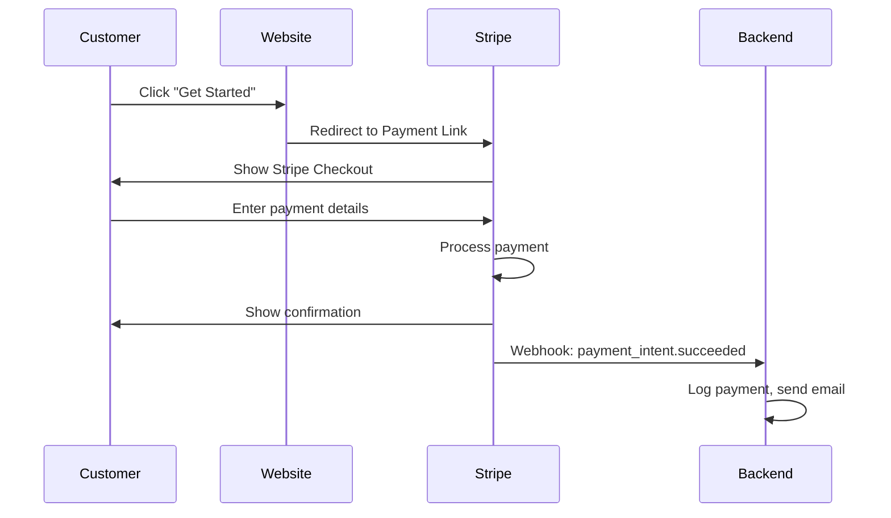

# XFTradesmen Stripe Integration Guide

> Complete guide for integrating Stripe payments with the XFTradesmen website.

---

## Current Configuration

### Stripe Products

| Item | Price ID | Amount | Type |
|------|----------|--------|------|
| **Setup Fee** | `price_1SZrGb50EObjxaVXFrD5FQiB` | £129 | One-time |
| **Monthly Subscription** | `price_1SZrIg50EObjxaVXj2jiYCRF` | £30/month | Recurring |

### Checkout Link

```
https://buy.stripe.com/6oU4gsbhy2r14ZN3Uw83C00
```

This is a **Payment Link** that combines both the setup fee and monthly subscription.

---

## Environment Variables

Set these in your `.env` file (root directory):

```bash
# Stripe API Keys
STRIPE_SECRET_KEY=sk_live_51SKK3u50EObjxaVX...
STRIPE_PUBLIC_KEY=pk_live_51SKK3u50EObjxaVXfruQlNtCP3m4gamZFWHdWaPMmI8VdafklBTXa2A7UKECc9ng7qp7xzWsR5jmZxWFAtFx7PPY004gTEAwNF

# Product Configuration  
STRIPE_PRODUCT_ID=prod_TWv6VpCUEmJ516

# Webhook (for payment confirmations)
STRIPE_WEBHOOK_SECRET=whsec_...
```

---

## Implementation Details

### Frontend (packages.rs)

The packages page uses a **direct Stripe Payment Link**:

```rust
const STRIPE_CHECKOUT_URL: &str = "https://buy.stripe.com/6oU4gsbhy2r14ZN3Uw83C00";

// Link directly to Stripe checkout
<a href=STRIPE_CHECKOUT_URL target="_blank">
    "GET STARTED NOW"
</a>
```

**Why direct link?**
- Simpler implementation
- No SSR/hydration issues
- Stripe handles all payment UI
- Automatic mobile optimization

### Backend Webhook (payment.rs)

Stripe sends webhook events to confirm payments:

```
POST /api/webhooks/stripe
```

**Events handled:**
- `payment_intent.succeeded` → Payment completed
- `payment_intent.payment_failed` → Payment failed

---

## Stripe Dashboard Setup

### 1. Create Product

1. Go to [Stripe Dashboard → Products](https://dashboard.stripe.com/products)
2. Create product: "XFTradesmen Website Package"
3. Add two prices:
   - £129 one-time (Setup)
   - £30/month recurring (Subscription)

### 2. Create Payment Link

1. Go to [Payment Links](https://dashboard.stripe.com/payment-links)
2. Select your product
3. Configure:
   - ✅ Collect customer email
   - ✅ Allow promotion codes (optional)
   - ✅ Confirmation page redirect (optional)
4. Copy the link URL

### 3. Configure Webhook

1. Go to [Developers → Webhooks](https://dashboard.stripe.com/webhooks)
2. Add endpoint: `https://yourdomain.com/api/webhooks/stripe`
3. Select events:
   - `payment_intent.succeeded`
   - `payment_intent.payment_failed`
   - `customer.subscription.created`
   - `customer.subscription.deleted`
4. Copy webhook signing secret to `.env`

---

## Testing

### Test Mode

Use test keys for development:

```bash
STRIPE_PUBLIC_KEY=pk_test_...
STRIPE_SECRET_KEY=sk_test_...
```

Test cards:
- `4242 4242 4242 4242` → Success
- `4000 0000 0000 0002` → Declined

### Verify Webhook

```bash
# Listen for local webhook events
stripe listen --forward-to localhost:8080/api/webhooks/stripe
```

---

## Flow Diagram



---

## Price IDs Reference

```javascript
// Setup fee (one-time)
const SETUP_PRICE_ID = "price_1SZrGb50EObjxaVXFrD5FQiB";

// Monthly subscription (recurring)
const MONTHLY_PRICE_ID = "price_1SZrIg50EObjxaVXj2jiYCRF";

// Combined checkout link
const CHECKOUT_URL = "https://buy.stripe.com/6oU4gsbhy2r14ZN3Uw83C00";
```

---

## Troubleshooting

| Issue | Solution |
|-------|----------|
| "Parse error" on packages page | Backend may not be running or returning empty response |
| Webhook not receiving events | Check webhook URL and signing secret |
| Test payments not working | Ensure using test mode keys |
| SSL error | Stripe requires HTTPS in production |

---

## Files Modified

| File | Purpose |
|------|---------|
| `frontend-leptos/src/pages/packages.rs` | Packages page with pricing |
| `backend/.env` | Stripe API keys |
| `.env` (root) | Environment configuration |
| `backend/apps/api/src/web/handlers/payment.rs` | Webhook handler |
