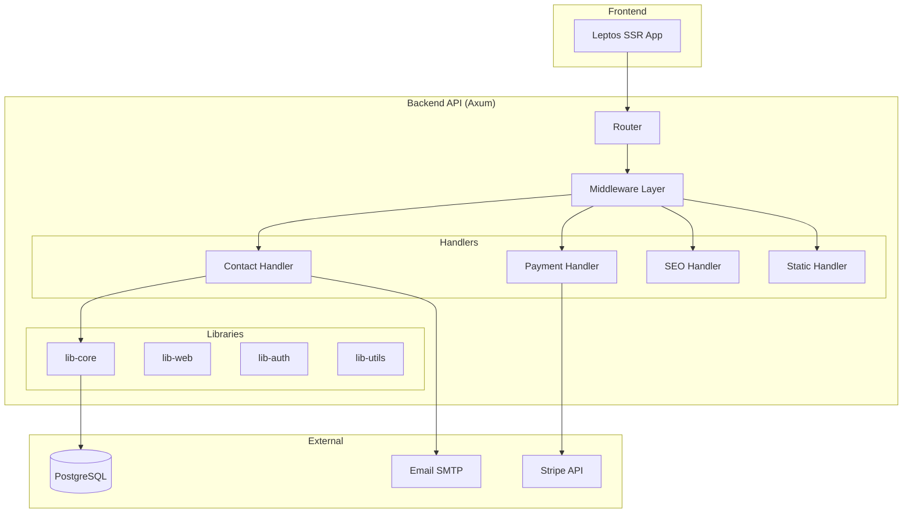
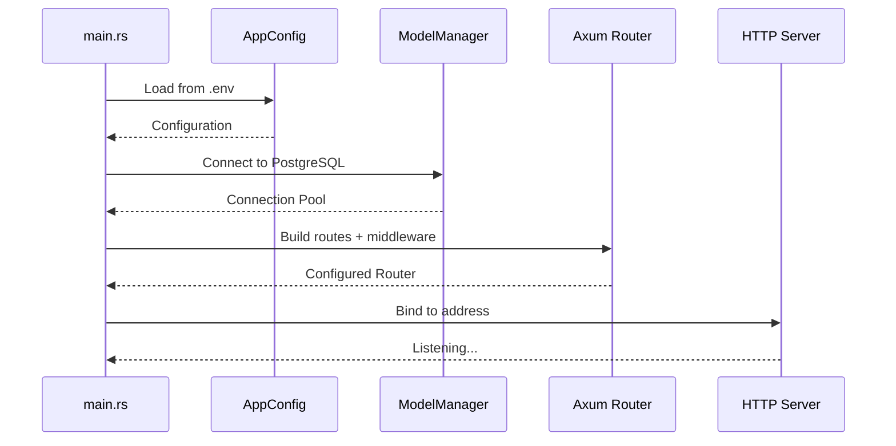

# XFTradesmen Backend Architecture

> **Rust-Based High-Performance API Server**

## Overview

The backend is an **Axum-based REST API** built with Rust, providing:
- Contact form processing with email notifications
- Stripe payment integration
- Database persistence with PostgreSQL
- SEO sitemap/robots.txt generation
- Static asset serving

---

## Architecture Diagram



---

## Project Structure

```
backend/
├── apps/
│   └── api/                    # Main API binary
│       └── src/
│           ├── main.rs         # Entry point
│           ├── config.rs       # Configuration loading
│           ├── middleware.rs   # CORS, logging, compression
│           └── web/
│               ├── handlers/   # API endpoint handlers
│               │   ├── contact.rs    # POST /api/contact
│               │   ├── payment.rs    # Stripe webhooks
│               │   └── seo.rs        # Sitemap generation
│               └── routes_*.rs       # Route definitions
│
├── libs/
│   ├── lib-core/              # Database models & business logic
│   ├── lib-web/               # Web utilities & error handling
│   ├── lib-auth/              # Authentication (JWT, passwords)
│   └── lib-utils/             # Common utilities
│
├── schema.sql                 # Database schema definition
└── .env                       # Environment configuration
```

---

## API Endpoints

### Contact Form
```http
POST /api/contact
Content-Type: application/json

{
  "name": "John Doe",
  "email": "john@example.com",
  "message": "I need help with..."
}
```

**Response:**
```json
{
  "success": true,
  "message": "Contact form submitted successfully",
  "data": { "id": 42 }
}
```

**What happens:**
1. Validates input (name, email, message)
2. Saves to `contact_messages` table
3. Sends email notification asynchronously
4. Returns success response

---

### Stripe Webhook
```http
POST /api/webhooks/stripe
Stripe-Signature: t=1234567890,v1=...
```

**Events handled:**
- `payment_intent.succeeded` - Payment completed
- `payment_intent.payment_failed` - Payment failed

**Security:**
- Signature verified using `STRIPE_WEBHOOK_SECRET`
- Invalid signatures rejected with 400

---

### SEO Endpoints
```http
GET /sitemap.xml    # Auto-generated sitemap
GET /robots.txt     # Crawler instructions
```

---

### Static Files
```http
GET /api/stripe/config    # Stripe publishable key
GET /pkg/*               # Frontend assets
```

---

## Database Schema

### Tables

| Table | Purpose |
|-------|---------|
| `users` | Handyman accounts (authentication) |
| `customers` | Customer contact info (from bookings) |
| `bookings` | Service booking requests |
| `contact_messages` | Contact form submissions |

### Key Schema Details

```sql
-- Contact Messages (what the frontend uses)
CREATE TABLE contact_messages (
    id SERIAL PRIMARY KEY,
    name VARCHAR(255) NOT NULL,
    email VARCHAR(255) NOT NULL,
    message TEXT NOT NULL,
    created_at TIMESTAMP WITH TIME ZONE DEFAULT CURRENT_TIMESTAMP
);

-- Bookings (service requests with payments)
CREATE TABLE bookings (
    id SERIAL PRIMARY KEY,
    customer_id INTEGER REFERENCES customers(id),
    work_type VARCHAR(50) NOT NULL,        -- plumbing, electrical, etc.
    location TEXT NOT NULL,
    price_cents INTEGER NOT NULL,          -- Price in cents (€150 = 15000)
    status VARCHAR(50) DEFAULT 'pending',  -- pending, confirmed, completed
    payment_status VARCHAR(50) DEFAULT 'pending',
    payment_intent_id TEXT,                -- Stripe PaymentIntent
    created_at TIMESTAMP WITH TIME ZONE DEFAULT CURRENT_TIMESTAMP
);
```

---

## Environment Variables

| Variable | Description | Default |
|----------|-------------|---------|
| `DATABASE_URL` | PostgreSQL connection string | Required |
| `APP_SERVER__HOST` | Bind address | `127.0.0.1` |
| `APP_SERVER__PORT` | Port number | `8080` |
| `STRIPE_SECRET_KEY` | Stripe API key | Required for payments |
| `STRIPE_WEBHOOK_SECRET` | Webhook signature key | Required |
| `SMTP_HOST` | Email server | Optional |
| `SMTP_USERNAME` | Email username | Optional |
| `SMTP_PASSWORD` | Email password | Optional |
| `RUST_LOG` | Log level | `info` |

---

## Startup Sequence



### CLI Commands

```bash
# Start server
cargo run -p api

# Test database connection
cargo run -p api -- --test-db

# Run migrations  
cargo run -p api -- --migrate

# Debug mode
RUST_LOG=debug cargo run -p api
```

---

## Middleware Stack

1. **CORS** - Cross-origin requests (frontend at different port)
2. **Compression** - Gzip response compression
3. **Logging** - Request/response tracing
4. **Error Handling** - Consistent error responses

```rust
pub fn apply_middleware(router: Router) -> Router {
    router
        .layer(CorsLayer::permissive())
        .layer(CompressionLayer::new())
        .layer(TraceLayer::new_for_http())
}
```

---

## Library Crates

### lib-core
Database models and business logic:
- `ModelManager` - Database connection pool
- `ContactBmc` - Contact message CRUD
- `CustomerBmc` - Customer management
- `BookingBmc` - Booking operations
- Email service integration

### lib-web
Web utilities:
- Error types and handling
- Response formatting
- Request extractors

### lib-auth
Authentication (partially implemented):
- Password hashing (HMAC-SHA256)
- JWT token generation
- Token salt management

### lib-utils
Common utilities:
- Date/time helpers
- Validation functions

---

## Security Features

| Feature | Implementation |
|---------|----------------|
| **Password Storage** | HMAC-SHA256 hashing (never plain text) |
| **JWT Tokens** | Salt-based signature (invalidates on user change) |
| **Webhook Verification** | Stripe signature validation |
| **Input Validation** | Server-side validation on all inputs |
| **CORS** | Configured for frontend origin |
| **SQL Injection** | SQLx prepared statements |

---

## Performance Optimizations

- **Connection Pooling**: SQLx PgPool for database
- **Async Runtime**: Tokio for non-blocking I/O
- **Gzip Compression**: Reduced response sizes
- **Email Async**: Non-blocking email sending
- **Indexed Queries**: Optimized database lookups

---

## Future Enhancements

- [ ] User authentication API
- [ ] Booking creation workflow
- [ ] Payment checkout flow
- [ ] Admin dashboard API
- [ ] Rate limiting
- [ ] API versioning
